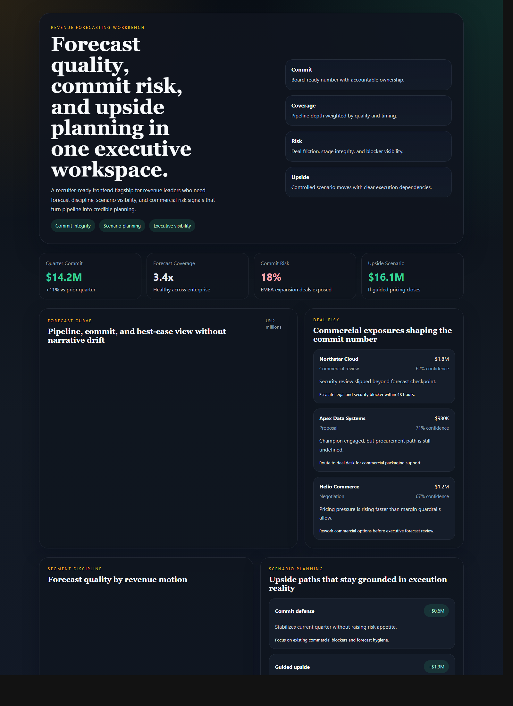
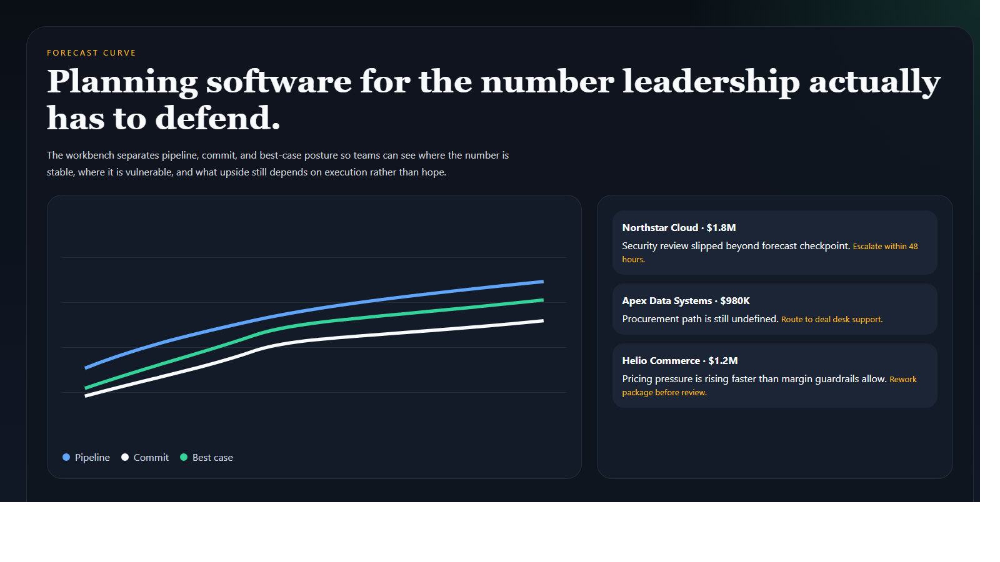
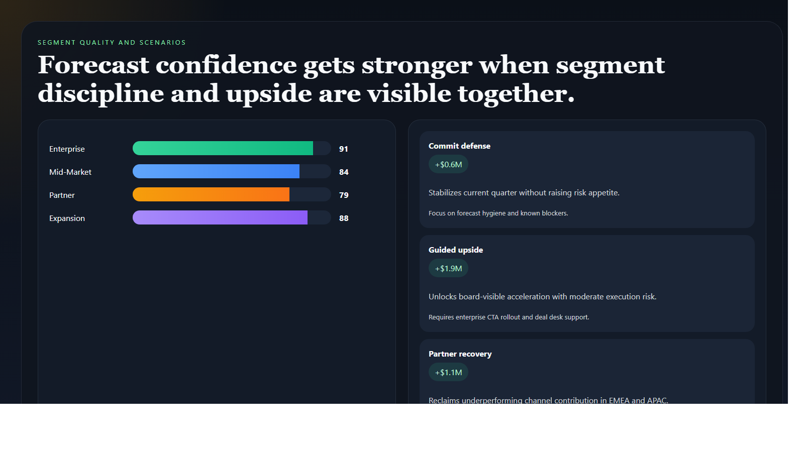
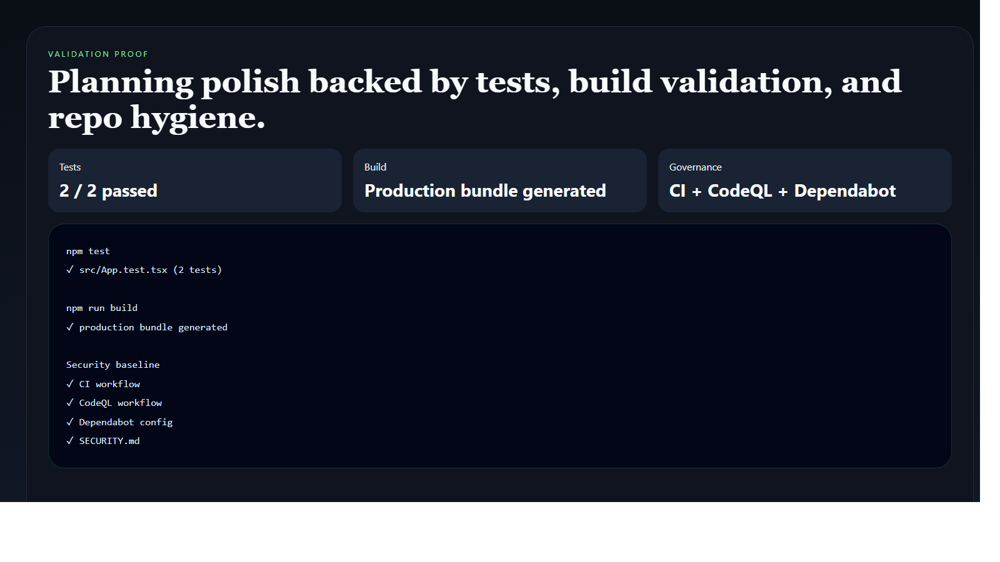

# Revenue Forecasting Workbench

> **React + TypeScript portfolio project** demonstrating forecast quality, commit-risk visibility, scenario planning, and executive-facing commercial systems design.

**Recruiter takeaway:** *"This person can turn revenue forecasting into a decision surface leadership would actually trust."*

---

## Project Overview

| Attribute | Detail |
|---|---|
| **Frontend Stack** | React 19 + Vite + TypeScript |
| **Domain** | Revenue forecasting, commit quality, scenario planning |
| **Audience** | Revenue leadership, RevOps, sales operations, executive stakeholders |
| **Signal Areas** | Commit integrity · coverage health · deal risk · upside planning |
| **Portfolio Role** | Frontend flagship for commercial planning and forecast governance |
| **Validation** | Vitest + Testing Library |

---

## Executive Summary

Revenue Forecasting Workbench is a recruiter-ready frontend project built to feel like a real internal planning system. Instead of burying the number inside spreadsheets, it makes commit quality, forecast risk, and upside scenarios visible in one executive-grade workspace.

It is designed to show that revenue planning can be productized with the same seriousness as platform tooling.

---

## Business Problem

Forecast conversations often collapse into spreadsheet theater: large pipeline numbers with weak quality signals, commit assumptions without risk visibility, and scenario planning that lacks ownership. Leadership needs a workspace that makes the number explainable, challengeable, and operationally credible.

---

## Solution

This workbench turns forecasting into a coordinated frontend surface for:

- commit and pipeline curve visibility
- deal-level risk signaling
- segment forecast quality comparison
- upside scenario planning
- executive-grade planning UX

---

## Architecture

```text
Forecast datasets and commercial signals
    |
    v
Static TypeScript data model
    |
    v
React application shell
    |
    +--> executive signal cards
    +--> forecast curve views
    +--> deal-risk panels
    +--> segment quality chart
    +--> scenario planning workspace
```

### Workspace Flow

1. Leadership lands on a clear commit and coverage view.
2. Forecast trend visuals separate pipeline, commit, and best-case posture.
3. Deal-risk panels expose the blockers shaping the number.
4. Segment quality views show where forecast discipline is strong or weak.
5. Scenario cards frame upside without losing execution reality.

---

## Screenshots

### Hero Capture



### Forecast Curve and Risk View



### Segment and Scenario View



### Validation Proof



---

## Key Design Decisions

| Decision | Rationale |
|---|---|
| **Executive planning framing** | Makes the repo feel like real commercial infrastructure, not a sales dashboard |
| **Risk next to commit** | Keeps the number tied to the operational blockers that threaten it |
| **Scenario cards with notes** | Prevents upside planning from becoming empty optimism |
| **Distinct finance palette** | Gives this project its own visual identity within the broader portfolio |
| **Purposeful charting** | Uses charts to improve trust in the number, not just decorate it |

---

## What An Engineering Leader Sees Here

- frontend systems design grounded in commercial planning reality
- ability to turn forecast logic into a credible product surface
- strong information hierarchy for leadership workflows
- portfolio breadth across revenue, operations, security, and governance tooling

---

## Getting Started

### Prerequisites

- Node.js 20+
- npm

### Setup

```bash
git clone https://github.com/mizcausevic-dev/revenue-forecasting-workbench.git
cd revenue-forecasting-workbench
npm install
cp .env.example .env
npm run dev
```

Open:

- `http://localhost:5173`

### Run Tests

```bash
npm test
```

### Build

```bash
npm run build
```

---

## What This Demonstrates

- premium frontend execution for commercial and planning workflows
- forecast decisioning translated into product structure
- strong charting and scenario communication choices
- React + TypeScript implementation with tests and production-minded repo hygiene
- portfolio depth beyond backend systems alone

---

## Future Enhancements

- territory and manager filters
- forecast confidence bands and sensitivity analysis
- board-pack export modes
- scenario toggles tied to live commercial interventions
- API-backed history for quarter-over-quarter forecast trust analysis

---

## Tech Stack

[](https://react.dev/)
[](https://vite.dev/)
[](https://www.typescriptlang.org/)
[](https://recharts.org/)
[](https://vitest.dev/)
[](https://opensource.org/license/mit)

### Portfolio Links

- [LinkedIn](https://www.linkedin.com/in/mirzacausevic)
- [Skills Page](https://mizcausevic.com/skills/)
- [Medium](https://medium.com/@mizcausevic)
- [GitHub](https://github.com/mizcausevic-dev)

---

*Part of [mizcausevic-dev's GitHub portfolio](https://github.com/mizcausevic-dev) — demonstrating revenue systems thinking, commercial-planning product design, and executive-grade forecast storytelling.*
